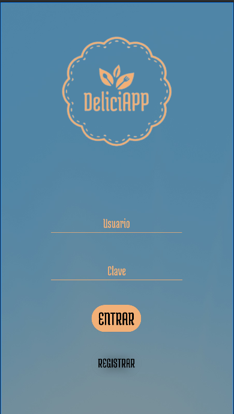
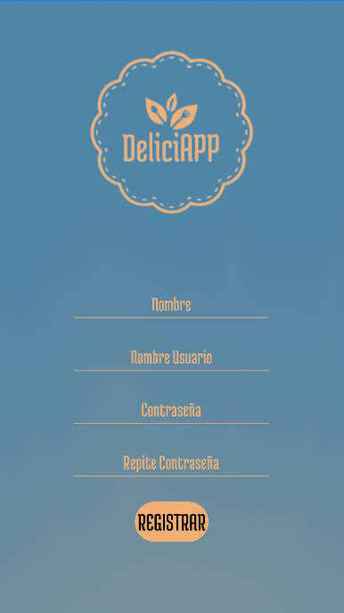

<h1 align="center">🍔 DeliciApp 🍔</h1>

<h1 align="center">  </h1>

¡Bienvenido a DeliciApp! Esta es una aplicación de recomendación de restaurantes, diseñada para facilitar el proceso de buscar esos restaurantes más ocultos. Con DeliciApp, podrás explorar ubicaciones y obtener más detalles sobre los seleccionados.

## 📸 Capturas de pantalla 📸

A continuación, se muestran algunas capturas de pantalla de la aplicación:

*Inicio de la app.*

*Registro.*

## Características clave

- Explora restaurantes de forma rápida.
- Selecciona el tipo de comida que deseas en ese momento.
- Selecciona el rango de precio que quieres gastar.
- Añade tus restaurantes favoritos.

## Tecnologías

Para poder desarrollar esta app he utilizado las siguientes tecnologías:

- Android Studio

  

- Firebase

  
